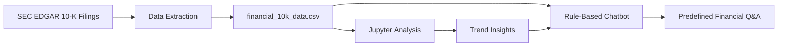

# Financial Analysis & AI Chatbot Prototype

A data-driven financial analysis project built around SEC 10-K filings for **Microsoft**, **Tesla**, and **Apple** (fiscal years 2023–2025). This repository combines structured data extraction, exploratory analysis in Jupyter, and a rule-based financial chatbot prototype designed to demonstrate how filing data can power conversational financial tools.

**Live repository:** [github.com/Hassanmahmood4/Financial_Analysis_Forage](https://github.com/Hassanmahmood4/Financial_Analysis_Forage)

---

## Overview

Public companies disclose standardized financial information in annual 10-K filings. This project turns that raw regulatory data into an analysis-ready dataset, identifies cross-company trends with Python, and packages the insights into a lightweight chatbot that answers predefined financial questions.

The work is structured in two phases:

1. **Financial data analysis** — extract, clean, and analyze key metrics from SEC EDGAR filings.
2. **Chatbot prototype** — map predefined user queries to data-backed responses using rule-based logic.

This project demonstrates practical skills in financial data handling, Python analytics, notebook-based reporting, and prototype conversational system design.

---

## Key Highlights

- Extracted and standardized **5 core financial metrics** across **3 companies** and **3 fiscal years**
- Built a reproducible dataset with filing metadata and SEC source links
- Performed trend analysis including YoY growth, margins, balance sheet ratios, and CAGR
- Delivered a documented Jupyter analysis with narrative conclusions
- Implemented a command-line chatbot prototype with demo and interactive modes
- Packaged submission-ready deliverables for coursework and portfolio review

---

## Tech Stack

| Category | Tools |
|---|---|
| Language | Python 3.11 |
| Data analysis | pandas, Jupyter Notebook |
| Visualization | matplotlib |
| Data formats | CSV, Excel (`.xlsx`), HTML |
| Chatbot | Rule-based Python CLI |
| Source data | [SEC EDGAR](https://www.sec.gov/edgar/search/) 10-K filings |

---

## Project Workflow



---

## Dataset

The dataset includes the following metrics for Microsoft, Tesla, and Apple:

| Metric | Description |
|---|---|
| Total Revenue | Annual revenue from 10-K income statement data |
| Net Income | Bottom-line profitability |
| Total Assets | Balance sheet asset base |
| Total Liabilities | Balance sheet obligations |
| Cash Flow from Operating Activities | Operating cash generation |

Each record also includes:

- Ticker and CIK
- Fiscal year and fiscal period end date
- 10-K filing date
- SEC accession number
- Direct SEC filing URL

**Files:**

- `financial_10k_data.csv` — primary analysis dataset (USD)
- `financial_10k_data_millions.csv` — same data in USD millions
- `financial_10k_data.xlsx` — workbook with raw data and source notes

---

## Key Findings (2023–2025)

| Company | Revenue Trend | Profitability Trend | Notable Insight |
|---|---|---|---|
| **Microsoft** | Strong growth ($211.9B → $281.7B) | Net income rose to $101.8B in 2025 | Most consistent growth across revenue, profit, and operating cash flow |
| **Apple** | Largest revenue base ($416.2B in 2025) | Rebounded to $112.0B net income in 2025 | Remains the highest-revenue company in the sample |
| **Tesla** | Relatively flat revenue (~$97B → $94.8B) | Net income fell sharply ($15.0B → $3.8B) | Greatest profitability pressure despite asset base expansion |

Additional analysis in the notebook covers:

- Year-over-year revenue and net income growth
- Net margin and operating cash flow margin
- Liabilities-to-assets ratio
- Compound annual growth rate (CAGR) from 2023 to 2025

---

## Repository Structure

```text
Financial_Analysis_Forage/
├── financial_10k_data.csv              # Extracted 10-K dataset
├── financial_10k_data_millions.csv     # USD-millions version
├── financial_10k_data.xlsx             # Excel workbook with source notes
├── financial_10k_analysis.ipynb      # Jupyter trend analysis
├── financial_10k_analysis.html       # Static HTML summary report
├── financial_chatbot.py                # Rule-based chatbot prototype
├── chatbot_documentation.md            # Chatbot design and limitations
├── chatbot_test_results.txt              # Sample chatbot test output
├── financial_chatbot_submission.zip    # Packaged chatbot deliverable
├── requirements.txt                    # Python dependencies
└── README.md                           # Project documentation
```

---

## Getting Started

### Prerequisites

- Python 3.10+
- pip

### Installation

```bash
git clone https://github.com/Hassanmahmood4/Financial_Analysis_Forage.git
cd Financial_Analysis_Forage
pip install -r requirements.txt
```

### Run the Jupyter analysis

```bash
jupyter notebook financial_10k_analysis.ipynb
```

Or open the exported report:

- `financial_10k_analysis.html`

### Run the chatbot

Interactive mode:

```bash
python3 financial_chatbot.py
```

Demo mode (predefined test questions):

```bash
python3 financial_chatbot.py --demo
```

---

## Chatbot Capabilities

The chatbot answers predefined questions such as:

- What is Apple's total revenue in 2025?
- How has Microsoft's net income changed over the last year?
- What is Tesla's operating cash flow in 2024?
- Which company had the highest revenue in 2025?
- Which company had the strongest revenue growth?
- What are the main financial trends?

Example response:

```text
User: How has Microsoft's net income changed over the last year?
Bot: Microsoft's net income increased from $88.14 billion in 2024 to $101.83 billion in 2025.
     That is a change of $13.70 billion, or 15.54%.
```

Type `help` inside the chatbot for supported query examples.

---

## Methodology

### 1. Data extraction

Financial figures were compiled from SEC EDGAR 10-K filings and standardized using consistent GAAP concepts:

- Revenue: `RevenueFromContractWithCustomerExcludingAssessedTax`
- Net income: `NetIncomeLoss`
- Assets / liabilities: `Assets`, `Liabilities`
- Operating cash flow: `NetCashProvidedByUsedInOperatingActivities`

### 2. Analysis

The Jupyter notebook loads the CSV dataset and calculates:

- YoY percentage changes by company
- Profitability and cash flow margins
- Balance sheet leverage indicators
- Multi-year CAGR comparisons

### 3. Chatbot design

The chatbot uses keyword-based query routing and returns formatted responses derived directly from the dataset. It is intentionally lightweight and transparent, making it suitable as a prototype for more advanced NLP or LLM-based financial assistants.

---

## Skills Demonstrated

- SEC filing research and financial metric extraction
- Data cleaning and structured dataset design
- Exploratory data analysis with pandas
- Financial ratio and growth analysis
- Data visualization and narrative reporting
- Prototype conversational system development
- Technical documentation and reproducible project packaging

---

## Limitations

- Covers only three companies and fiscal years 2023–2025
- Uses historical 10-K data only (not live market data)
- Chatbot supports predefined queries, not open-ended natural language
- Does not provide investment advice
- Rule-based logic is a prototype foundation, not a production AI system

---

## Future Improvements

- Add natural language processing for flexible question parsing
- Expand coverage to additional companies and industries
- Integrate live SEC or market data APIs
- Add source citations in every chatbot response
- Deploy as a web application with Streamlit or Flask
- Add unit tests for chatbot query routing and calculations

---

## Author

**Hassan Mahmood**  
GitHub: [@Hassanmahmood4](https://github.com/Hassanmahmood4)

---

## License

This project was developed for educational and portfolio purposes. Feel free to review, reference, or build upon it with attribution.
